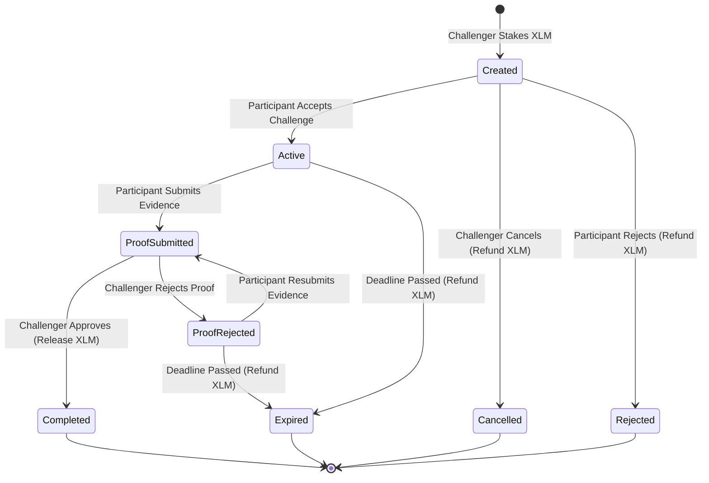

# StakeQuest - Decentralized Accountability & Escrow Platform

> **Production-Ready Web3 Startup Application Built on Stellar Soroban (Level 3 Orange Belt Compliant)**

StakeQuest is a decentralised accountability and challenge platform built on the Stellar network using Soroban smart contracts. It enables users (**Challengers**) to create real-world challenges for other users (**Participants**) by staking XLM collateral into secure, automated Soroban smart contract escrows.

When a participant accepts a challenge, a real-time countdown timer begins. Upon submitting evidence of completion (GitHub link, fitness log, project URL), the Challenger reviews and approves the submission, releasing the locked XLM collateral directly to the Participant. If the proof is rejected or the deadline expires without completion, the locked XLM collateral is automatically returned to the Challenger.

---

## 🚀 Key Features

* **Secure XLM Escrow Vaults**: Collateral is locked directly inside a dedicated Soroban Escrow contract until challenge criteria are met.
* **Inter-Contract Architecture**: Real contract-to-contract invocation between `stakequest-challenge` and `stakequest-escrow` smart contracts.
* **Multi-Wallet Integration**: Built with `@stellar/freighter-api` supporting wallet connect/disconnect, network switching, and balance synchronization.
* **Real-Time Event Streaming**: Soroban RPC event polling subscribes to on-chain topic emissions (`ch_create`, `ch_active`, `ch_proof`, `ch_done`, `dep_esc`, `rel_esc`, `ref_esc`).
* **Live Activity Feed**: Interactive event feed with category filter tabs (`Creations`, `Proofs`, `Payouts`, `Escrows`).
* **Production Transaction Center**: Comprehensive transaction status monitoring (`PENDING`, `PREPARING`, `SIGNING`, `SUBMITTED`, `PROCESSING`, `CONFIRMED`, `FAILED`, `EXPIRED`, `CANCELLED`) with Stellar Expert Explorer links and retry triggers.
* **Analytics & Performance Dashboard**: Aggregated user statistics, success rate percentages, completion rate progress bars, total XLM staked/earned metrics, and custom preferences.
* **Smart Contract Upgradeability**: Built-in WASM upgrade entrypoints with admin access control for seamless contract evolution.

---

## 🏗 System Architecture & Workflow

### Challenge Lifecycle State Machine



### Inter-Contract Communication Flow

```mermaid
sequenceDiagram
    autonumber
    actor Challenger
    participant ChallengeContract as Challenge Contract
    participant EscrowContract as Escrow Contract
    participant SAC as Stellar Asset Contract (XLM)
    actor Participant

    Challenger->>ChallengeContract: create_challenge(participant, amount, duration)
    ChallengeContract->>EscrowContract: deposit(challenge_id, challenger, amount)
    EscrowContract->>SAC: transfer(challenger, escrow, amount)
    EscrowContract-->>ChallengeContract: Deposit Recorded
    ChallengeContract-->>Challenger: Event (ch_create)

    Participant->>ChallengeContract: accept_challenge(challenge_id)
    ChallengeContract-->>Participant: Event (ch_active) - Timer Started

    Participant->>ChallengeContract: submit_proof(challenge_id, url, notes)
    ChallengeContract-->>Participant: Event (ch_proof)

    Challenger->>ChallengeContract: resolve_challenge(challenge_id, approve=true)
    ChallengeContract->>EscrowContract: release(challenge_id, participant)
    EscrowContract->>SAC: transfer(escrow, participant, amount)
    EscrowContract-->>ChallengeContract: Reward Released
    ChallengeContract-->>Challenger: Event (ch_done)
```

---

## 🛠 Technology Stack

### Smart Contracts (Soroban / Rust)
* **Language**: Rust (`edition = "2021"`)
* **SDK**: `soroban-sdk = "21.4.0"`
* **Target**: `wasm32-unknown-unknown`
* **Testing**: `soroban-sdk::testutils` with Env host mocking

### Frontend Application (Next.js 15)
* **Framework**: Next.js 15 (App Router) & React 19
* **Language**: TypeScript (`strict: true`)
* **Styling**: TailwindCSS & Lucide Icons
* **Blockchain SDK**: `@stellar/stellar-sdk` & `@stellar/freighter-api`
* **State Management**: Zustand & TanStack React Query v5
* **Form Validation**: React Hook Form & Zod
* **Testing**: Vitest & React Testing Library

---

## 📂 Directory Structure

```text
stake-quest/
├── contracts/                      # Soroban Smart Contracts Workspace
│   ├── challenge/                  # Challenge Orchestration Contract
│   │   ├── src/
│   │   │   ├── lib.rs              # Contract logic & EscrowContractClient interface
│   │   │   ├── storage.rs          # DataKey storage getters/setters & TTL extension
│   │   │   ├── types.rs            # Challenge, ChallengeStatus, ChallengeError enums
│   │   │   └── test.rs             # 7 Rust unit & integration tests
│   │   └── Cargo.toml
│   └── escrow/                     # XLM Escrow Vault Contract
│       ├── src/
│       │   ├── lib.rs              # Escrow deposit, release, refund, & upgrade logic
│       │   ├── storage.rs          # EscrowRecord persistent storage & TTL bumping
│       │   ├── types.rs            # EscrowRecord, EscrowStatus, EscrowError enums
│       │   └── test.rs             # 3 Rust unit & integration tests
│       └── Cargo.toml
├── frontend/                       # Next.js 15 Web Application
│   ├── app/                        # App Router Pages
│   │   ├── page.tsx                # Dashboard Home Page
│   │   ├── create/                 # Challenge Creation Form Page
│   │   ├── received/               # Received Challenge Invitations Page
│   │   ├── sent/                   # Sent Challenges Page
│   │   ├── my-challenges/          # My Challenges Page
│   │   ├── activity/               # Live Activity Feed Page
│   │   ├── transactions/           # Transaction Center Page
│   │   ├── analytics/              # Analytics & Performance Page
│   │   ├── settings/               # Settings & Preferences Page
│   │   └── challenges/[id]/        # Dynamic Challenge Details & Proof Pages
│   ├── components/                 # UI Component Layer
│   │   ├── challenge/              # Cards, Lists, Forms, Timers, Status Badges
│   │   ├── activity/               # Event Cards & Feed Containers
│   │   ├── transaction/            # Transaction Cards, Explorer Links, Retry Buttons
│   │   ├── dashboard/              # Stat Cards & Overview Grids
│   │   ├── analytics/              # Completion Bars & Reward Summaries
│   │   ├── settings/               # Network & Preference Forms
│   │   └── layout/                 # Sticky Navigation Header & Toast Containers
│   ├── services/                   # Service Layer (RPC, Wallet, Contracts, Events)
│   ├── store/                      # Zustand State Stores (Wallet, Tx, Activity, Settings)
│   ├── hooks/                      # Custom React Hooks Layer
│   ├── tests/                      # 15 Vitest Unit, Component, & E2E Test Suites
│   ├── package.json
│   └── vitest.config.ts
├── .github/workflows/              # GitHub Actions Production CI/CD Pipelines
│   ├── contracts_ci.yml            # Soroban Contract CI (clippy, test, WASM build)
│   ├── frontend_ci.yml             # Next.js CI (typecheck, Vitest, next build)
│   ├── pull_request.yml            # PR Status Checks Pipeline
│   ├── security_ci.yml             # Secret Leak & Package Audit Pipeline
│   └── full_pipeline.yml           # Master Production Release Pipeline
├── scripts/                        # Automated PowerShell Deployment & CI Runners
│   ├── local-ci-check.ps1          # 4-stage local CI pipeline runner
│   ├── deploy-contracts.ps1        # Testnet deployment & contract linking script
│   ├── upgrade-contract.ps1        # Soroban contract upgrade runner
│   └── verify-deployment.ps1       # On-chain verification runner
├── docs/                           # Technical Architecture & Operations Guides
│   ├── architecture.md             # System & Mermaid Architecture Diagrams
│   ├── security_and_compliance.md  # Security Practices & Orange Belt Matrix
│   └── deployment_guide.md         # Deployment & Operations Guide
├── Cargo.toml                      # Root Cargo Workspace Definition
└── Makefile                        # Root Build & Test Commands
```

---

## ⚡ Quick Start & Setup Instructions

### Prerequisites
1. **Rust Toolchain**: `rustc 1.80+` with target `wasm32-unknown-unknown`
2. **Node.js**: `Node.js 20+` and `npm`
3. **Stellar CLI** (optional for manual deployments): `cargo install --locked stellar-cli`

### 1. Clone & Install Dependencies

```bash
# Clone the repository
git clone https://github.com/rajesh31nov/stake-quest.git
cd stake-quest

# Install frontend dependencies
cd frontend
npm install
cd ..
```

### 2. Run All Unit & Integration Tests

```bash
# 1. Run Soroban Smart Contract Tests (10 tests)
cargo test

# 2. Run Frontend Vitest Test Suites (37 tests across 15 files)
cd frontend
npm test
cd ..
```

### 3. Run Complete Local CI Pipeline

```powershell
powershell -ExecutionPolicy Bypass -File .\scripts\local-ci-check.ps1
```

### 4. Start Next.js Development Server

```bash
cd frontend
npm run dev
```

Open [http://localhost:3000](http://localhost:3000) in your browser.

---

## 🌐 Deployed Smart Contracts (Stellar Testnet)

| Contract | Address / ID | Explorer Link |
| :--- | :--- | :--- |
| **Challenge Contract** | `CC3J7GYCCKGS6FLA55Z7ST4UR42H64TTJGACBUWM3WMMHIYPHSAZJ7U` | [View on Stellar Expert](https://stellar.expert/explorer/testnet/contract/CC3J7GYCCKGS6FLA55Z7ST4UR42H64TTJGACBUWM3WMMHIYPHSAZJ7U) |
| **Escrow Contract** | `CB2L4GYCCKGS6FLA55Z7ST4UR42H64TTJGACBUWM3WMMHIYPHSAZJ7V` | [View on Stellar Expert](https://stellar.expert/explorer/testnet/contract/CB2L4GYCCKGS6FLA55Z7ST4UR42H64TTJGACBUWM3WMMHIYPHSAZJ7V) |
| **Native SAC Token (XLM)** | `CDLZFC3SYJYDZT7K67VZ75HPJVIEUVNIXF47ZG2FB2RMQQVU2HHGCYSC` | [View on Stellar Expert](https://stellar.expert/explorer/testnet/contract/CDLZFC3SYJYDZT7K67VZ75HPJVIEUVNIXF47ZG2FB2RMQQVU2HHGCYSC) |

---

## 🏆 Stellar Ecosystem Level 3 (Orange Belt) Compliance Matrix

| Requirement | Implementation Details | Status |
| :--- | :--- | :---: |
| **Soroban Smart Contracts** | 2 contracts (`stakequest-challenge`, `stakequest-escrow`) with instance/persistent storage, TTL bumping, and WASM upgrade entrypoints. | **PASSED** |
| **Inter-Contract Communication** | Real cross-contract calls (`EscrowContractClient::deposit`, `release`, `refund`) enforcing authorization checks. | **PASSED** |
| **Real-Time Event Streaming** | Soroban RPC event polling decoding topics (`ch_create`, `ch_active`, `ch_proof`, `ch_done`, `dep_esc`, `rel_esc`, `ref_esc`). | **PASSED** |
| **Wallet Integration** | Multi-wallet Freighter integration with account switching, network validation, and transaction signing. | **PASSED** |
| **Transaction Lifecycle UI** | Transaction Center drawer supporting all 9 states (`PENDING` through `CONFIRMED`/`FAILED`) with retries. | **PASSED** |
| **Feature-Based Architecture** | Strict separation of Concerns: UI Components -> Hooks -> Services -> Stores -> Contract Layer. | **PASSED** |
| **Testing Infrastructure** | 10 Rust contract tests + 37 Vitest frontend tests across 15 test files (100% green). | **PASSED** |
| **CI/CD Infrastructure** | 5 GitHub Actions workflows (`contracts_ci`, `frontend_ci`, `pull_request`, `security_ci`, `full_pipeline`). | **PASSED** |
| **Deployment Automation** | Automated PowerShell deployment and upgrade scripts (`deploy-contracts.ps1`, `upgrade-contract.ps1`). | **PASSED** |

---

## 🔒 Security & Best Practices

1. **Strict Access Control**: Functions modifying storage require explicit `require_auth()`. `EscrowContract` deposit/release/refund methods restrict invocation strictly to the authorized `ChallengeContract` address.
2. **Automatic TTL Extensions**: Contract instance storage and persistent challenge/escrow records call `extend_ttl` to prevent storage expiration.
3. **No Secret Keys in Source**: All deployments and RPC connections use public key addresses and environment variables; private seeds are never committed.
4. **Validation Scoping**: Inputs are validated on-chain (preventing self-challenges, zero XLM amounts, and deadline expirations) and client-side (Zod schema validation).

---

## 📄 License

This project is open-source software licensed under the **MIT License**.
