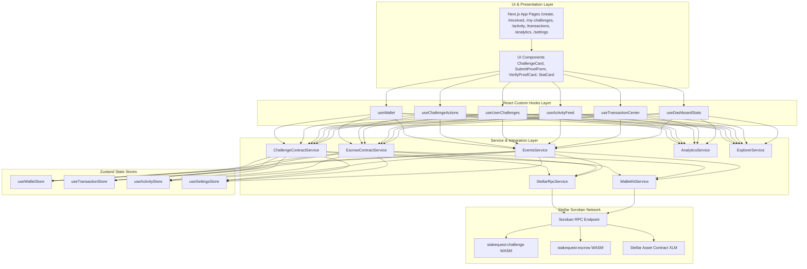
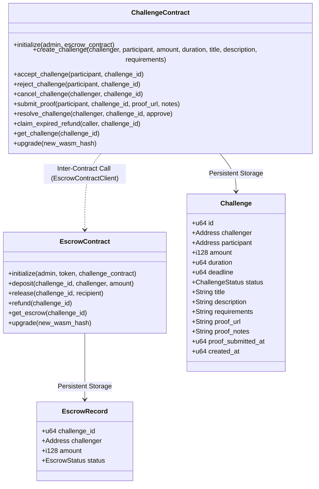
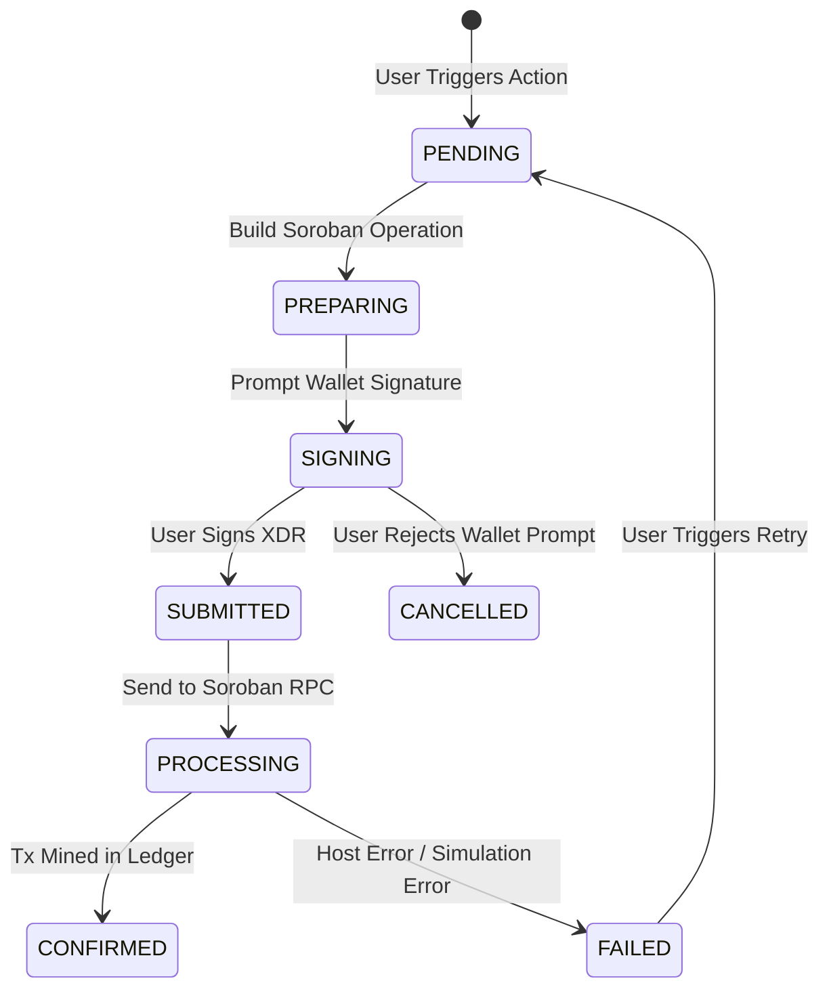
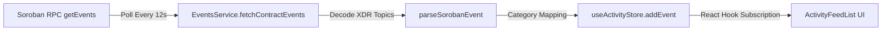

# StakeQuest System Architecture & Data Flow

This document details the architectural design, component layers, data flows, and state machines powering **StakeQuest**.

---

## 1. Application Layer Architecture

StakeQuest adheres to a strict feature-based architecture ensuring complete separation of concerns between user interface rendering, React custom hooks, asynchronous services, state management stores, and blockchain contract interaction layers.

---

## 2. Soroban Storage & Inter-Contract Architecture

### Smart Contract Storage Model

---

## 3. Transaction Lifecycle & Status State Machine

---

## 4. Real-Time Event Streaming Pipeline

